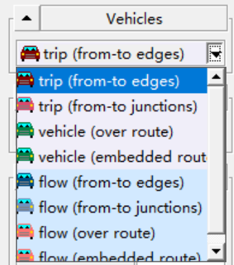
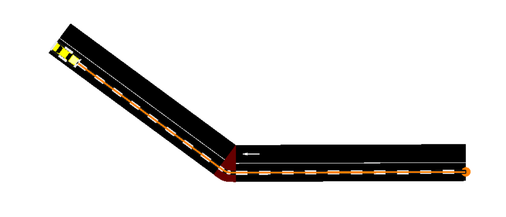

# SUMO

> SUMO (Simulation of Urban MObility), 一个由Eclipse维护的开源道路仿真模拟应用, 提供了多种交通运输及包括路人行为场景模拟的解决方案, 此文档为个人在学习SUMO使用期间个人对SUMO原理及应用的理解的总结.

[TOC]

## SUMO 安装注意事项

经个人测试, SUMO在Windows的Linux子系统, WSL2(Windows Subsystem of Linux)下, SUMO的图形交互应用`sumo-gui`会出现**路网结构无法正常显示**的问题, 而同时因个人有使用OmNet++下Veins框架通过traci接口与SUMO进行接口通信的需求, Windows下OmNet++的Veins依赖包(Simu5G)**无法正常编译**, 只能通过WSL使用OmNet++, 且Windows下的SUMO与WSL2下的Veins间因WSL2的Hyper-V虚拟机性质, **无法正常通信**.

为避免绕弯路, **推荐使用**Ubuntu系统或预装有OmNet++与Veins框架的Ubuntu虚拟机

## SUMO 文件结构(File Structure)

此部分将对*SUMO应用自身的文件结构*以及*SUMO工程文件目录下文件*进行分析

### SUMO应用自身文件结构

此部分以SUMO在Windows环境下的目录结构(`../Eclipse/Sumo/`)为例, SUMO安装目录下的文件夹有

* `./bin` - SUMO自身及附带工具的可执行文件
* `./data` - SUMO的图形界面所需要的图像材质数据等
* `./doc` - 包含SUMO官方的使用范例(examples), Python包文档(pydoc), 基础教学用范例(tutorial)及html用户文档(userdoc)
* `./include` - 包含libsumo的C Header文件
* `./share` - (未知)
* `./tools` - SUMO应用运行时所调用的Python脚本文件, 包括traci接口

如果要更改traci接口在与其他应用通信时的行为表现, 即需更改`./tools/traci`目录下的脚本文件

### SUMO工程目录下文件

SUMO在模拟时需要读取的文件种类偏多, 其中以下三种文件满足了SUMO最基本的情景模拟需求

* `*.sumocfg` - 模拟配置文件(configuration)
  里面记录了此SUMO交通模拟所需的输入文件(input), 运行时间管理(time), 以及GUI需求设置(gui_only)
* `*.net.xml` - 路网结构数据(road network)
  其中记录了SUMO模拟中的地图数据, 基本由节点(node)以及连接(edge)组成, 可通过SUMO附带的**netconvert**工具, 由osm地图数据转化得到, 也可由用户自己通过编辑此文件或通过SUMO的**netedit**组件, 在GUI界面中设计并保存得到
* `*.rou.xml` - 车流及路由数据(route)
  定义了场景模拟中会涉及的交通工具类型(vType), 路程内容(route), 交通工具实体(vehicle)以及在路程上行驶的车辆行程实体(trip)

在通过SUMO模拟道路场景时, SUMO通过读取`sumocfg`文件了解到此次模拟的相关配置, 并获取相关输入文件的位置(如路网文件`*.net.xml`及路由文件`*.rou.xml`)

以下为一个SUMO配置文件内容的一个示例.

```xml
<?xml version="1.0" encoding="UTF-8"?>

<!-- generated on 2022-03-10 16:29:46 by Eclipse SUMO GUI Version 1.12.0
-->

<configuration xmlns:xsi="http://www.w3.org/2001/XMLSchema-instance" xsi:noNamespaceSchemaLocation="http://sumo.dlr.de/xsd/sumoConfiguration.xsd">

    <input>
        <net-file value="D:\Documents\Python\simple.net.xml"/>
        <route-files value="D:\Documents\Python\simple.rou.xml"/>
    </input>

    <time>
        <begin value="0"/>
        <end value="1000"/>
        <step-length value="0.1"/>
    </time>

    <gui_only>
        <start value="true"/>
    </gui_only>

</configuration>
```

>注: 如需要在Python中通过traci接口启动SUMO的GUI界面, 需如示例所示, 将配置文件中`gui_only`下`start`项的值设置为`true`, 否则在使用`traci.start()`启动SUMO的GUI界面时, 即使GUI界面加载成功, Python终端仍无法返回`traci.start()`的值, 且无法进行任何进一步交互.

除以上三种基本的文件类型外, SUMO仍拥有多种输入文件类型可以被模拟配置文件`*.sumocfg`中的`input`项目所引用, 作为输入文件的补充(additional input), 如

* `*.flow.xml` - 与`*.rou.xml`相似, 都用于定义车辆实体
  而`*.rou.xml`只能对车辆实体进行逐一定义, 而`*.flow.xml`可以通过指定起点,终点与车辆数量, 一次性生成大量车辆实体, 适合当交通情景模拟需要创建**大量车辆**时使用
* `*.trip.xml` - 类似于`*.rou.xml`
  定义了交通工具实体的行程, 不过与`*.rou.xml`不同的是, `trip`项目只需指定行程的起点与终点, 中间途径的节点`node`会又SUMO自动补全, 而`*.rou.xml`必须指定交通工具实体于行程中经过的所有节点
* `*.turns.xml` - 定义SUMO中路口选择的概率

> 据个人经验, SUMO输入文件中定义内容与文件类型的限制并不严苛, 如`*.trip.xml`中定义的内容也可在`*.rou.xml`中被定义, 如在`*.rou.xml`文件中可定义一个trip 项目为: `<trip id="t_0" depart="0.00" ...>`. 同理`flow`项目也可在`*.rou.xml`中被定义

更多文件类型可以参考[官网](<https://sumo.dlr.de/docs/Other/File_Extensions.html>)

## 创建并运行一个最基本的SUMO情景模拟

>基于SUMO的配置文件与输入文件都可通过**手动编写**来使用, 本章节将先使用SUMO的GUI组件**创建情景**, 并在保存后放出**相关文件**的代码内容.

首先在确保环境变量中有SUMO的可执行文件目录的情况下打开SUMO的`netedit`工具(通常情况下, Windows下的安装包与Ubuntu下的apt安装均已完成了环境变量的设置)

命令行中输入`netedit`并回车, 等待GUI界面打开.


netedit的界面中因没有打开或创建的路网文件(network), 显示为空白.

### 创建路网结构(Road Network)

在File项中选择创建新网络`New Network`


路网编辑的第一步即在路网中创建第一个地点(节点).
确保菜单栏中的编辑模式已设置为`Network`


在`Network`模式下的工具栏中, 本章节中或需用到的常用工具从左到右依次为:

* `检查元素属性`
* `删除元素`
* `元素复选`
* `移动元素`
* `创建并连接元素`


#### 创建节点(Node)与连接(Edge)

确保`创建并连接元素`工具已被选中, 并开始在下方界面中点击创建第一个节点, 并在随后在不同位置创建第二个节点. 在创建两个节点的同时, 两个节点(`node`)之间的连接(`edge`)会被自动创建


如图所示, 路网中已经成功创建了两个节点, 并在两个节点中创建了一条道路作为连接. 在SUMO模拟中, 连接具有**方向性**(**directional**), 即道路拥有指定的起点与终点, 并具有单向性. 选中工具栏中的`检查元素属性`工具后选中图中已创建的道路或节点, 即可查看此对象的属性


在左侧的面板中可以得知这条道路(`edge`)的`id`为`E4`, 且起点`from`与终点`to`分别为`J10`与`J11`.

我们可以在左侧面板中设置节点(`node`)或道路(`edge`)的`id`以及其他属性, 包括设定节点的`pos`属性来调节该节点在路网中的**坐标位置**.

#### 创建对向道路(Reverse Edge)

如想在已创建道路的基础上添加一个对向的道路(`J11`到`J10`), 我们可以通过使用`创建并连接元素`工具依次点击`J11`节点与`J10`节点即可完成创建.


如果想要图方便, 省去为每一条道路创建对向道路的步骤, 可在选中`创建并连接元素`工具的同时, 在工具栏右侧选中`自动创建对向道路`项(从右往左第一项).


#### 连续创建节点与连接

如想连续创建多个连续的节点, 可在选中`创建并连接元素`工具后, 在工具栏右侧选中`一次性创建多个连续的节点`(从右往左第二项), 并开始在路网中创建节点.


连续的节点之间会自动创建连接, 并可通过按下`ESC`来中止连续创建.


#### 保存路网结构

在完成对路网的创建后, 通过`File->Save Network As...`来将路网保存为一个`*.net.xml`格式的文件

下为通过`netedit`创建的一个具有3个节点, 2对相向道路的路网结构图及其保存后的文本文件内容.


```xml
<?xml version="1.0" encoding="UTF-8"?>

<!-- generated on 2022-03-23 11:29:31 by Eclipse SUMO netedit Version 1.12.0
<configuration xmlns:xsi="http://www.w3.org/2001/XMLSchema-instance" xsi:noNamespaceSchemaLocation="http://sumo.dlr.de/xsd/netconvertConfiguration.xsd">

    <output>
        <output-file value="D:\Documents\Python\sample.net.xml"/>
    </output>

    <processing>
        <offset.disable-normalization value="true"/>
    </processing>

    <junctions>
        <no-turnarounds value="true"/>
    </junctions>

    <report>
        <aggregate-warnings value="5"/>
    </report>

</configuration>
-->

<net version="1.9" junctionCornerDetail="5" limitTurnSpeed="5.50" xmlns:xsi="http://www.w3.org/2001/XMLSchema-instance" xsi:noNamespaceSchemaLocation="http://sumo.dlr.de/xsd/net_file.xsd">

    <location netOffset="0.00,0.00" convBoundary="-7.26,52.74,62.07,74.22" origBoundary="10000000000.00,10000000000.00,-10000000000.00,-10000000000.00" projParameter="!"/>

    <edge id=":J1_0" function="internal">
        <lane id=":J1_0_0" index="0" speed="4.41" length="1.04" shape="22.83,54.34 22.53,54.35 22.32,54.39 22.13,54.48 21.88,54.66"/>
    </edge>
    <edge id=":J1_1" function="internal">
        <lane id=":J1_1_0" index="0" speed="7.04" length="3.12" shape="19.97,52.09 20.72,51.56 21.30,51.28 21.93,51.16 22.85,51.14"/>
    </edge>

    <edge id="-E0" from="J1" to="J0" priority="-1">
        <lane id="-E0_0" index="0" speed="13.89" length="35.06" shape="21.88,54.66 -6.31,75.51"/>
    </edge>
    <edge id="-E1" from="J2" to="J1" priority="-1">
        <lane id="-E1_0" index="0" speed="13.89" length="39.24" shape="62.07,54.49 22.83,54.34"/>
    </edge>
    <edge id="E0" from="J0" to="J1" priority="-1">
        <lane id="E0_0" index="0" speed="13.89" length="35.06" shape="-8.21,72.94 19.97,52.09"/>
    </edge>
    <edge id="E1" from="J1" to="J2" priority="-1">
        <lane id="E1_0" index="0" speed="13.89" length="39.24" shape="22.85,51.14 62.08,51.29"/>
    </edge>

    <junction id="J0" type="dead_end" x="-7.26" y="74.22" incLanes="-E0_0" intLanes="" shape="-7.26,74.22 -5.36,76.79 -7.26,74.22"/>
    <junction id="J1" type="priority" x="21.78" y="52.74" incLanes="-E1_0 E0_0" intLanes=":J1_0_0 :J1_1_0" shape="22.83,55.94 22.85,49.54 21.32,49.60 20.79,49.72 20.29,49.94 19.73,50.29 19.02,50.80">
        <request index="0" response="00" foes="00" cont="0"/>
        <request index="1" response="00" foes="00" cont="0"/>
    </junction>
    <junction id="J2" type="dead_end" x="62.07" y="52.89" incLanes="E1_0" intLanes="" shape="62.07,52.89 62.09,49.69 62.07,52.89"/>

    <connection from="-E1" to="-E0" fromLane="0" toLane="0" via=":J1_0_0" dir="s" state="M"/>
    <connection from="E0" to="E1" fromLane="0" toLane="0" via=":J1_1_0" dir="s" state="M"/>

    <connection from=":J1_0" to="-E0" fromLane="0" toLane="0" dir="s" state="M"/>
    <connection from=":J1_1" to="E1" fromLane="0" toLane="0" dir="s" state="M"/>

</net>
```

其中`:J1_0`与`:J1_1`为因转弯幅度偏大, SUMO自动于中间节点J1的内部创建的低速车段, 其余的4个`edge`项目都为3个节点之间依次连接的双向车道, 以及`junction`项目即为路网中的3个节点.

> 注: 于SUMO中, `junction`与`node`同义, 即上文中`<junction></junction>`可在实际编写中用`<node></node>`代替

[官网参考 - SUMO_Road_Networks](https://sumo.dlr.de/docs/Networks/SUMO_Road_Networks.html)

#### 从OSM地图文件中获取路网文件

(TODO: 过于无脑, 先搁着)

### 创建路网流量

在完成了路网结构的创建后, 即可开始在路网中添加车辆实体并为其规划路线.

将顶部菜单栏中编辑模式切换为`Demand`.


在菜单栏下方工具栏中可以找到在为路网编辑流量时的常用工具


其中左侧4项的图标与功能都与路网编辑模式中相同，右侧2项分别为

* `创建路线`
* `创建交通工具`

> 此外还有包括但不限于 `创建行人`, `创建交通灯`等工具, 等有需要时再介绍

使用`创建路线`工具, 即可以在一个或多个指定节点连接(edge)上创建一个路线(route), 而后可以使用`创建交通工具`创建车辆实体并绑定在**已创建好的路线上**.

或者也可以直接使用`创建交通工具`工具的特定模式, 直接在创建交通实体(vehicle)的同时指定路线(route), SUMO将自动创建路线实体并与交通实体绑定.

如果同一路线将被多个交通实体绑定, 那推荐使用`创建路线`工具先创建好路线, 再与交通实体绑定. 如果单一路线的使用率不高, 可能只有少数车辆实体通行, 那推荐使用`创建交通工具`工具快速创建车辆实体与对应路线实体.

因为这个章节为基础示例, 下属子章节中将直接使用`创建交通工具`来创建车辆.

#### 创建车辆实体的不同工具

选中`创建交通工具`, 左侧面板即会显示相对应的设置选项


其中, `Vehicles`项默认将设为`trip`



可选的选项代表了不同的交通工具创建方式:

* 创建路程(trip)实体(指定起点与终点edge)
* 创建路程(trip)实体(指定起点与重点junction)
* 创建交通工具(vehicle)实体(指定已有route)
* 创建交通工具(vehicle)实体(内嵌route)
* 创建交通流(flow)(指定起点与终点edge)
* 创建交通流(flow)(指定起点与终点junction)
* ...

`trip`与`flow`在SUMO文档中被统称为`待补全路线`(Incomplete Route), 即没有完整的路线定义, 只需指定起点与终点, 中间的途径路线将由SUMO自行判断并补全.

相对的, `vehicle`项创建出的交通工具需要绑定一个完整的路线(Route).

在实际应用中, `trip`适用于快速创建一个交通工具实体, `flow`适用于创建一个指定起点终点的**车辆流**, 即在特定时间内有一定数量相同类型的交通工具生成并完成路线, 省去了重复使用`vehicle`或`trip`创建车辆实体的工作.

此处先用`trip`进行简单的车辆创建与演示, 在章节末将显示`trip`, `flow`与`vehicle`在生成代码上的区别, 以便根据实际使用情况自行编写`*.rou.xml`文件.

#### 使用`trip`创建车辆实体

在上文中提到的`Vehicles`项中选择默认的`trip(from-to edges)`, 并选择将要创建的车辆类型`Parent vType`.


选择不同的车辆类型将继承不同的预定义车辆属性(最大速度, 加速度等). 之后的内容里会提及如何创建自定义车辆类型. 在这里先选择预设的车辆类型`DEGFAULT_VEHTYPE`.


在底下的面板里可以调整创建车辆的其他属性, 这里维持默认.

在右侧路网中依次点击路线的起终点, 后点击左侧面板的`完成路线创建(Finish route creation)`


完成后即可看到车辆在路网中被绘制


#### 保存车流

点击`File->Demand Elements->Save Demand Elements As...`来保存车流为`*.rou.xml`后缀的文件

以下为创建的车流路线及其生成的代码内容



```xml
<?xml version="1.0" encoding="UTF-8"?>

<!-- generated on 2022-03-23 16:43:28 by Eclipse SUMO netedit Version 1.12.0
-->

<routes xmlns:xsi="http://www.w3.org/2001/XMLSchema-instance" xsi:noNamespaceSchemaLocation="http://sumo.dlr.de/xsd/routes_file.xsd">
    <trip id="t_0" depart="0.00" from="E0" to="E1"/>
</routes>
```

#### `trip`, `vehicle`, `flow`间的代码内容对比

以下为分别使用创建`创建路程(trip)实体(指定起点与终点edge)`, `创建交通工具(vehicle)实体(内嵌route)`, `创建交通流(flow)(指定起点与终点edge)`, 创建流程都与上文类似, 与特定模式相关的**特殊参数**(如`flow`中的车流量相关的参数设置)将于后面间的章节解释.

```xml
    <flow id="f_0" begin="0.00" color="green" from="E0" to="E1" end="3600.00" vehsPerHour="1800.00"/>

    <trip id="t_0" depart="0.00" from="E0" to="E1"/>

    <vehicle id="v_0" depart="0.00" color="red">
        <route edges="E0 E1"/>
    </vehicle>
```

[参考官网 - Definition of Vehicles, Vehicle Types and Routes](https://sumo.dlr.de/docs/Definition_of_Vehicles%2C_Vehicle_Types%2C_and_Routes.html)

### 在SUMO-GUI中运行模拟

在`netedit`中确保**路网文件被读取**以及**车流文件被读取**的情况下点击`Edit->Open in sumo-gui` (同时`Edit`下的`Load additionals in sumo-gui`与`Load demand in sumo-gui`需要被选中, 否则车流数据**无法传递**至SUMO-GUI)


在开始操作前先点击`File->Save Configuration`, 将模拟配置保存为`*.sumocfg`文件, 后续便无需通过`netedit`打开`SUMO-GUI`, 只需在`SUMO-GUI`中读取此文件.

以下为保存的`*.sumocfg`的文件内容

```xml
<?xml version="1.0" encoding="UTF-8"?>

<!-- generated on 2022-03-23 17:28:42 by Eclipse SUMO GUI Version 1.12.0
-->

<configuration xmlns:xsi="http://www.w3.org/2001/XMLSchema-instance" xsi:noNamespaceSchemaLocation="http://sumo.dlr.de/xsd/sumoConfiguration.xsd">

    <input>
        <net-file value="D:\Documents\Python\sample.net.xml"/>
        <route-files value="D:\Documents\Python\sample.rou.xml"/>
    </input>

</configuration>
```

像之前解释的一样, `*.sumocfg`文件中存储了路网文件`net-file`与车流文件`route-files`的文件位置.

回到SUMO-GUI, 在顶部工具栏中调整模拟的步进延迟(Delay)为合适数值(即经过多长时间模拟自动进行下一步), 此处设为50ms.


点击左侧的`开始模拟(Start the loaded simulation)`按钮, 即可开始演示并等待模拟完成.
(或点击`模拟步进(Perform a single simulation step)`按钮完成单次步进).


车辆会在模拟开始时显示在路网中

>注: SUMO-GUI的车辆显示**默认为小三角**, 如需更换为`netedit`中一样的**车辆图形**, 可以打开`Edit->Edit Visualization`中的`Vehicles`标签页更改

待模拟完成后, 提示窗口弹出.


## 使用Python的Traci包与SUMO进行通信与控制